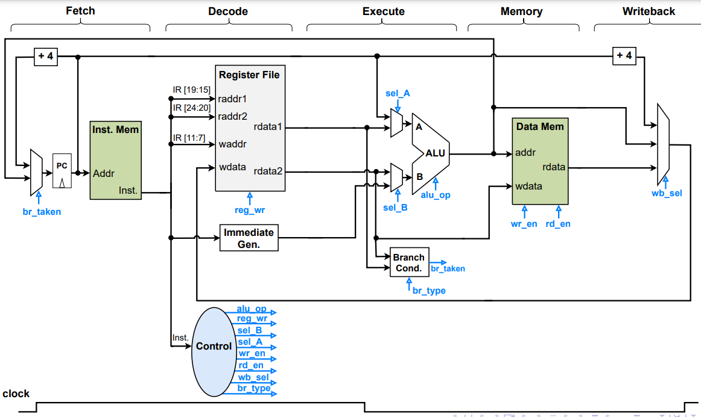

# Single Cycle Processor

This project implements a single-cycle RISC-V processor in SystemVerilog. It comprises modules for datapath, controller, instruction memory, data memory, ALU, immediate generation, register file, and various multiplexers.

## Contents

1. [Introduction](#introduction)
2. [Diagram](#diagram)
3. [Modules](#modules)
4. [Usage](#usage)
5. [Contributing](#contributing)
6. [License](#license)

## Introduction

The single-cycle processor is a fundamental design implementing the RISC-V instruction set architecture (ISA). It executes instructions in a single clock cycle, making it relatively simple but potentially slower compared to other designs like pipelined or superscalar processors.

This project aims to provide a basic implementation of a single-cycle RISC-V processor that can execute a subset of RISC-V instructions.

## Diagram

  
_Figure 1: Design Diagram_

## Modules

The processor is divided into several modules:

- **Datapath**: Implements the main data path of the processor, including registers, ALU, multiplexers, and data memory interface.
- **Controller**: Decodes instructions and generates control signals for the datapath.
- **Instruction Memory (IMEM)**: Stores instructions to be fetched and executed by the processor.
- **Data Memory (DMEM)**: Stores data accessed by load and store instructions.
- **ALU**: Performs arithmetic and logic operations on operands provided by the datapath.
- **Immediate Generation**: Generates immediate values for immediate-type instructions.
- **Register File**: Stores general-purpose registers used by the processor.

## Usage

To use this single-cycle processor:

1. Clone the repository to your local machine.
2. Open the project in a SystemVerilog-compatible IDE or text editor.
3. Simulate the design using a hardware description language (HDL) simulator like ModelSim or Synopsys VCS.
4. Modify the design as needed for your specific requirements.

## Contributing

Contributions to improve the project are welcome. If you have any suggestions, bug reports, or feature requests, please open an issue or submit a pull request on GitHub.

## License

This project is licensed under the [MIT License](LICENSE).
